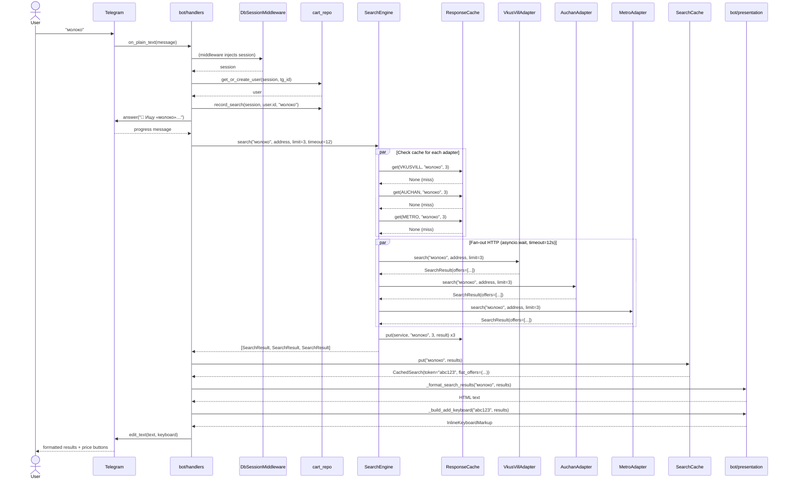
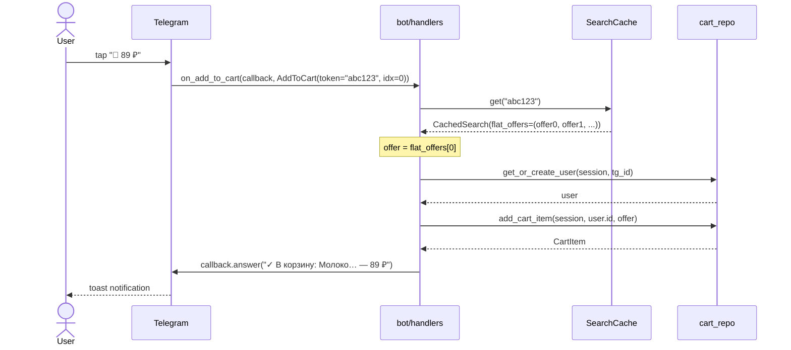
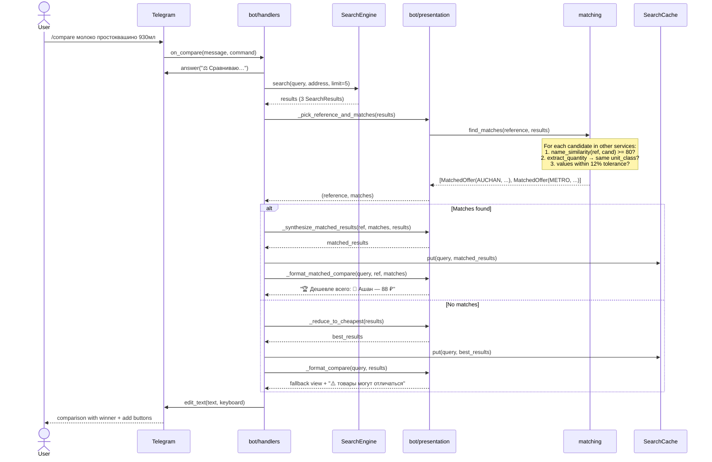
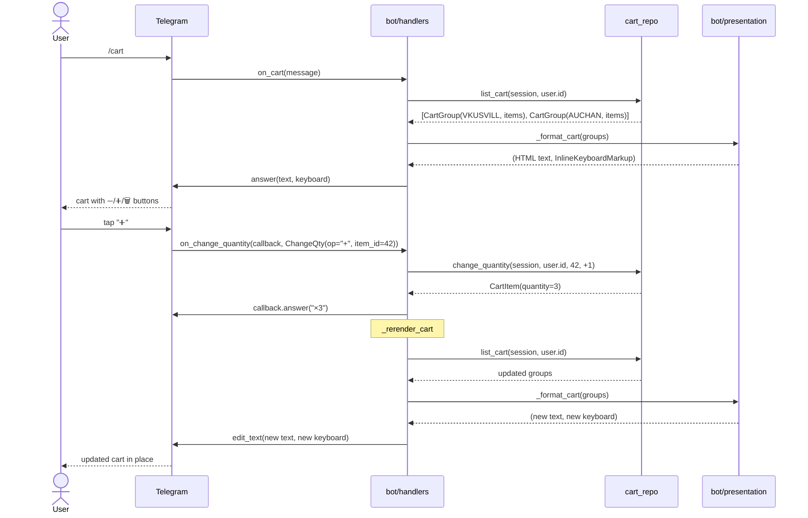
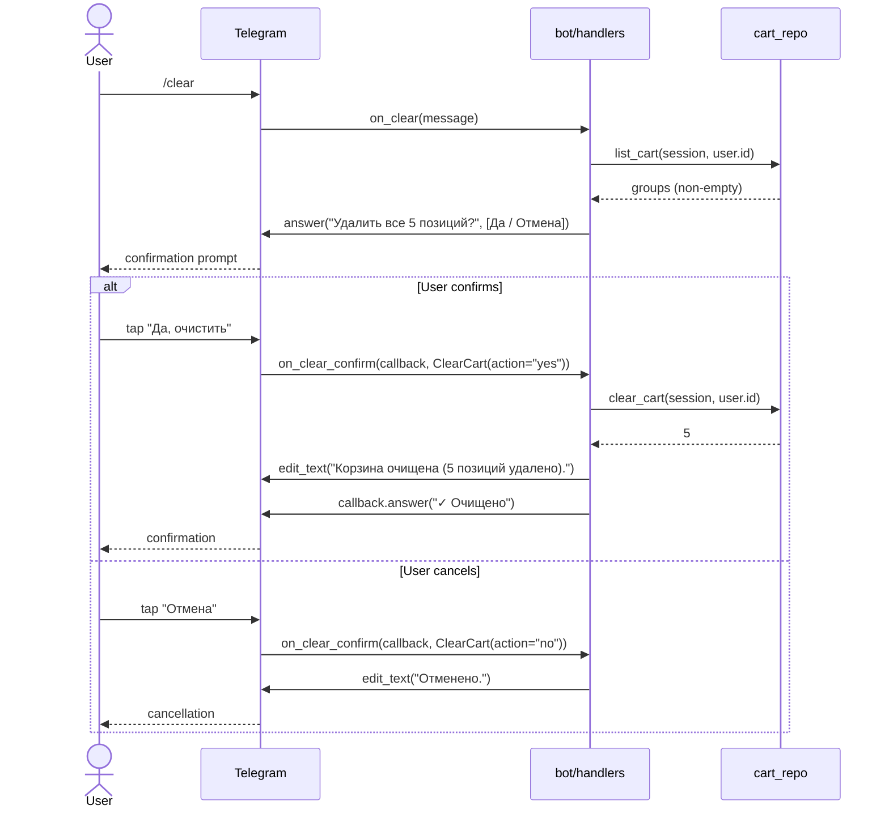
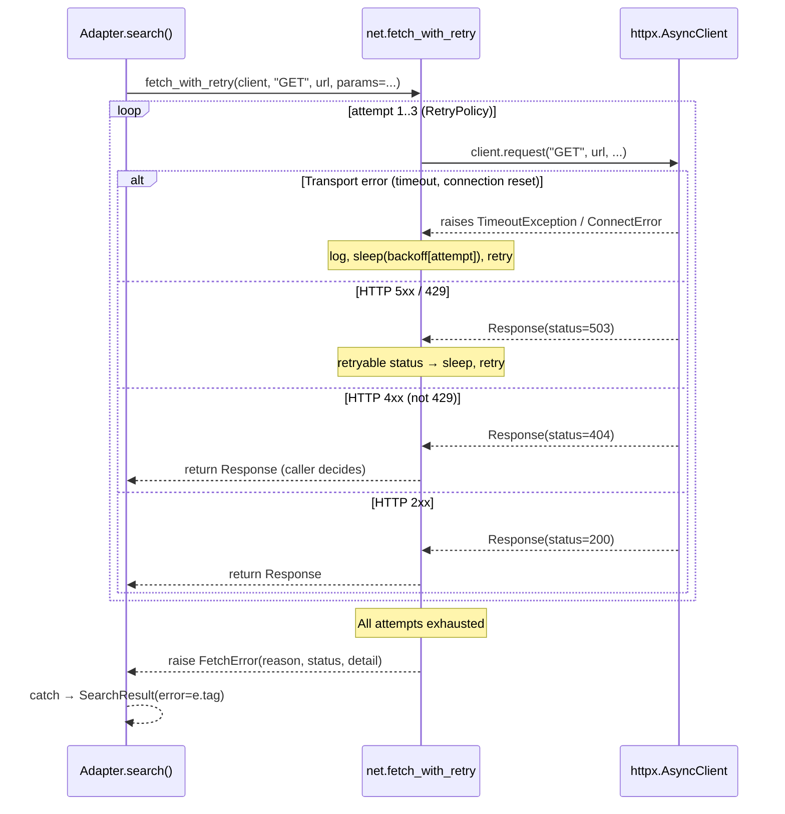

# Zakupator — Architecture

What lives where, how a request flows, and why we made the decisions
we made. For exact contracts see [SPEC.md](SPEC.md); for the friendly
pitch see [README.md](../README.md).

---

## 1. Components

```
┌────────────────────────────────────────────────────────┐
│                     Telegram                           │
└───────────────────────┬────────────────────────────────┘
                        │ long-polling (aiogram 3)
                        ▼
┌────────────────────────────────────────────────────────┐
│                     bot/                               │
│  handlers.py · presentation.py · callbacks.py          │
└─────┬────────────────────────────────────────┬─────────┘
      │                                        │
      │ search queries                         │ cart / history writes
      ▼                                        ▼
┌────────────────────┐                 ┌────────────────────┐
│    search.py       │                 │    cart_repo.py    │
│  fan-out adapter   │                 │  pure SQL helpers  │
│  orchestration     │                 └─────────┬──────────┘
└─────┬──────────────┘                           │
      │                                          ▼
      │                                  ┌────────────────┐
      │ cache hit → return               │     db.py      │
      │ miss → parallel calls            │  SQLAlchemy    │
      ▼                                  │  async engine  │
┌────────────────────┐                   └────────┬───────┘
│ response_cache.py  │                            │
│  TTL LRU, 5 min    │                            ▼
└─────┬──────────────┘                     SQLite (default)
      │                                    or Postgres
      ▼
┌────────────────────┐
│   adapters/*.py    │  VkusVill · Auchan · Metro
│  service-specific  │
│  parsing           │
└─────┬──────────────┘
      │
      ▼
┌────────────────────┐
│     net.py         │  retry policy, backoff, FetchError
└─────┬──────────────┘
      │
      ▼
   httpx.AsyncClient
      │
      ▼
  external services
```

Each box is a single module under `src/zakupator/`. There are no
framework classes exposed across module boundaries — everything travels
as the data types in [SPEC §1](SPEC.md#1-data-model).

---

## 2. Request flow: `/search молоко`

1. `bot.on_plain_text` / `on_search` — parses text, resolves current
   user via middleware (`middleware.py`), records query in
   `search_history`.
2. `SearchEngine.search(query, address, limit_per_service=3, timeout=12)`.
3. For each adapter:
   - `ResponseCache.get(service, normalized_query, limit)` — if hit,
     short-circuit.
   - Otherwise, schedule `adapter.search(...)` as an asyncio task
     named `search/<service>`.
4. `asyncio.wait(tasks, timeout=12)` — done tasks yield their result;
   pending tasks are cancelled and their SearchResult is synthesized
   with `error="timeout"`.
5. Successful non-empty results are written back to `ResponseCache`.
6. Results are reordered to match the adapter list (stable for the UI).
7. `bot` builds an inline keyboard from `SearchCache.put(query, results)`,
   which freezes the flat `(service, offer)` list and returns a short
   token. Each "add to cart" button carries `a:<token>:<flat_idx>`.
8. `a:…` callback resolves via `SearchCache.get(token)` → `cart_repo.add_cart_item`.

The whole round-trip is typically 1–2 seconds for a cold query.

---

## 3. Request flow: `/compare молоко простоквашино 930мл`

1. Same steps 1–6 as `/search`.
2. `_pick_reference_and_matches` picks a reference offer — priority
   `[VKUSVILL, AUCHAN, METRO]`, first service that returned offers wins.
   First offer in that service is the reference.
3. `matching.find_matches(reference, results)` returns at most one
   `MatchedOffer` per *other* service. Services with no same-product
   match are absent.
4. If ≥1 match found: render "comparable product" view + savings vs
   reference.
5. If 0 matches: render "top result per service" fallback with a
   "сопоставимые товары не найдены" banner. This is deliberately
   honest — false positives would mislead users about the best deal.

See [SPEC §3](SPEC.md#3-cross-service-matching) for thresholds.

---

## 4. Design decisions

### 4.1 Why these three services

Short version: everything else is either behind anti-bot protection
we can't cleanly bypass (Ozon Fresh, Yandex Lavka, Perekrestok Vprok,
Magnit), or requires reverse-engineering client-side request signing
(Samokat, Kuper).

VkusVill / Auchan / Metro are the only mass-market grocery services
whose public web interfaces accept plain HTTP requests without
residential proxies, headless Chrome, or signing schemes. Full recon
notes are in [recon.md](recon.md).

The architecture is modular — adding a fourth service when we're
willing to accept the operational cost means writing one new adapter
file (see [ADAPTERS.md](ADAPTERS.md)), not refactoring the orchestrator.

### 4.2 Why two caches

`response_cache` caches entire `SearchResult`s to avoid redundant
outbound requests. It's keyed on the *query* and is bot-agnostic.

`search_cache` caches per-display snapshots of individual `Offer`s so
callback buttons resolve to the exact price/link the user saw. It's
keyed on a short per-display token.

Merging them into one cache would either:
- make callback lookups O(N) over all cached queries (slow and ugly), or
- leak response-cache keys into the callback schema (brittle — a bare
  query string can exceed Telegram's 64-byte limit).

### 4.3 Why `httpx.MockTransport` instead of respx

respx is fine, but adds a dependency and mixes its own matchers with
pytest. `MockTransport` is a single callable `handler(request) ->
Response` that lives in stdlib-adjacent httpx. We get full control with
zero dep churn — see `tests/conftest.py::mock_client`.

### 4.4 Why strict matching thresholds

False positives mislead users ("cheapest is X" when X is a different
product). False negatives just degrade gracefully to a "no match"
banner. The asymmetry argues for strictness.

Concrete thresholds (`_NAME_SIM_THRESHOLD=80`,
`_QTY_RELATIVE_TOLERANCE=0.12`) were picked by eyeballing real captured
data during recon. They are not tuned by any training procedure — they
are opinion. If a future regression shows too many false negatives,
bump them in code with a test case pinning the new behaviour.

### 4.5 Why no pre-filled cart on service websites

We explored this, and: none of the three services expose a URL scheme
that pre-populates a cart from outside. Cart-add requires a
session-cookie-authenticated POST to each service's own backend, which
in turn requires either:
- reverse-engineering the login + cart flow per service, OR
- a browser extension companion that clicks add-to-cart on product
  pages on the user's behalf.

Both are significant ongoing maintenance burden with hostile upstream
behavior. Current compromise: cart items in the bot are hyperlinks to
the product page on the service. User opens, clicks "в корзину", repeat.
Multi-tap but honest.

### 4.6 Why SQLite by default

Single-process bot, single operator, low write rate, high read-for-cart
rate. SQLite is literally the right tool. `DATABASE_URL` already
accepts Postgres URLs, so switching is `pip install asyncpg` and an
env var — no code changes.

### 4.7 Why aiogram 3 (not python-telegram-bot / telethon)

aiogram 3 has first-class async, first-class typing, idiomatic
dependency injection via middleware, and the cleanest inline-keyboard
API of the three. PTB v20+ is also good, but its DI story is heavier
and its async migration is still settling.

### 4.8 Why `from __future__ import annotations` everywhere

Two reasons: (1) unified forward-reference behavior across 3.11/3.12,
(2) all annotations become strings at import, so `typing`-only
dependencies (`TracebackType`, etc) don't need runtime import guards.
This is why we silence ruff's TCH rules — they'd add `TYPE_CHECKING`
blocks that buy us nothing.

---

## 5. Failure modes and the humanizer

Adapters never raise. They return `SearchResult(error="tag")`. The bot
maps tags to user copy in `_humanize_error`. Known tags are documented
in [SPEC §1.4](SPEC.md#14-searchresult-dataclass).

The humanizer falls through to a generic "временно недоступен" for
unknown tags. That's a safety net, not a feature — new tags SHOULD
also get explicit copy.

---

## 6. Observability

Currently: Python `logging` at `LOG_LEVEL` (defaults to INFO), stderr
sink, the docker-compose config rotates logs via json-file driver
(10 MB × 5 files). That's it.

Non-goals for 0.1.0:
- metrics (Prometheus, OTel)
- structured logging (JSON lines)
- distributed tracing

These are all justified additions once the bot has more than one
operator. Until then, `journalctl -u zakupator -f` or
`docker compose logs -f` are sufficient.

---

## 7. Deployment topology

Two supported shapes, both single-host:

**Docker Compose** — `docker-compose.yml` + `Dockerfile`. Multi-stage
build, non-root `zakupator` user, SQLite on a named volume
(`zakupator-data:/data`), restart-on-failure, log rotation.

**systemd unit** — `deploy/zakupator.service`. Same venv, runs under
a dedicated `zakupator` system user, hardened (NoNewPrivileges,
ProtectSystem=strict, PrivateTmp, ProtectKernelTunables, etc).

Both are described in [README.md](../README.md) with copy-paste
install commands.

---

## 8. Sequence diagrams

### 8.1 `/search молоко` — full flow



### 8.2 Add to cart (button click)



### 8.3 `/compare молоко простоквашино 930мл`



### 8.4 `/cart` → quantity change → re-render



### 8.5 `/clear` confirmation flow



### 8.6 Adapter internals: retry flow


